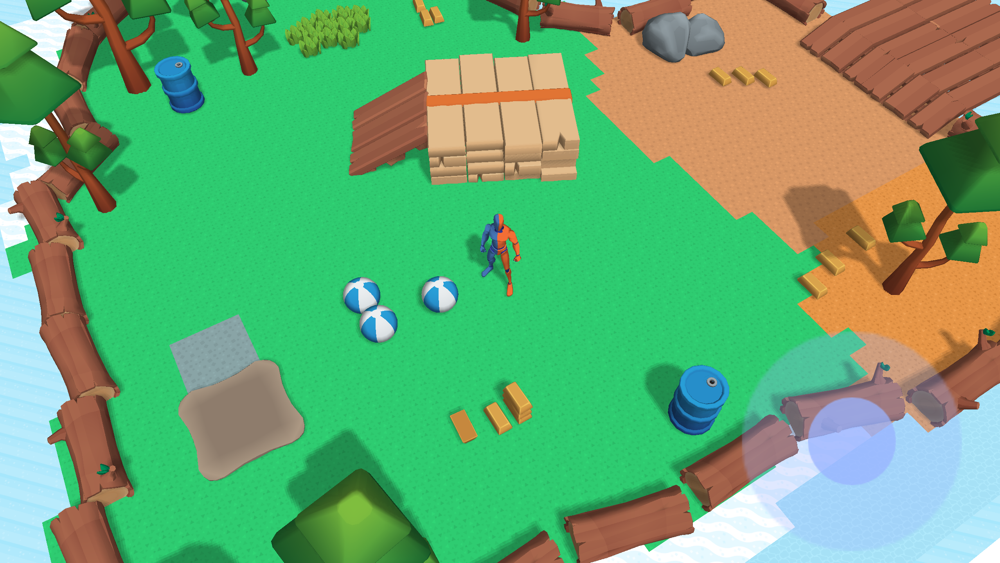
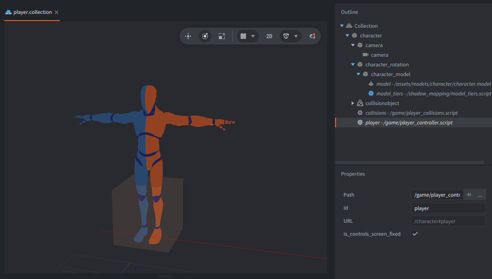
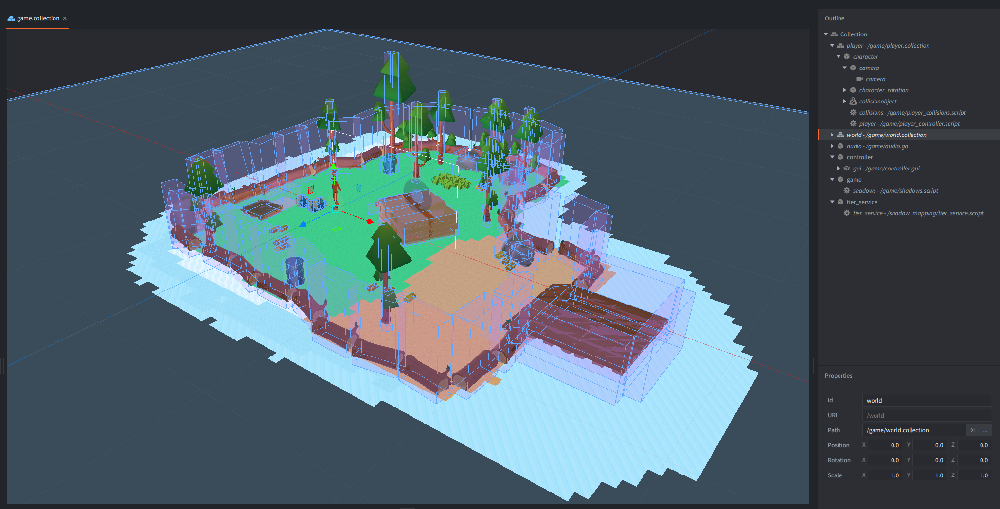
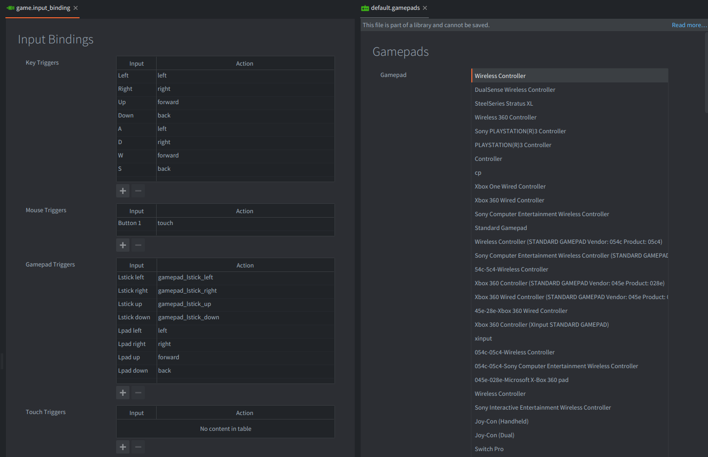
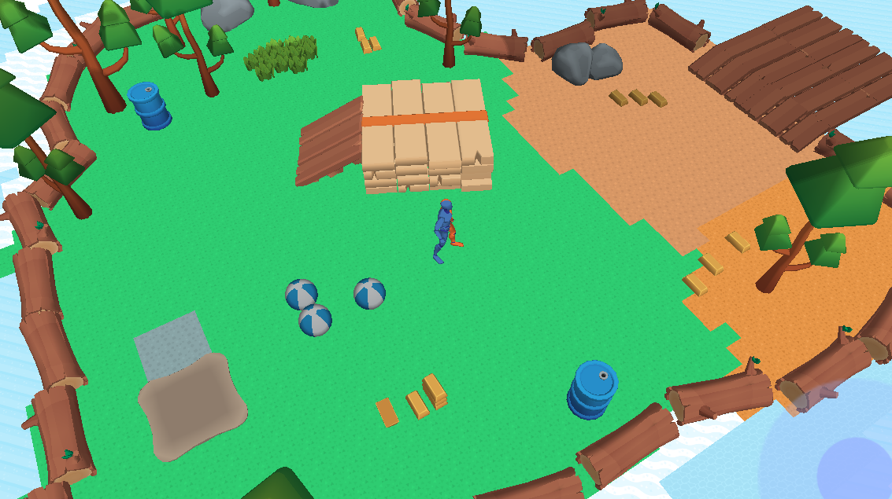
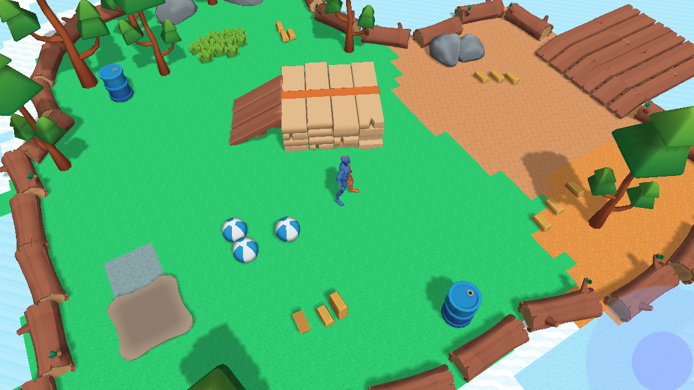
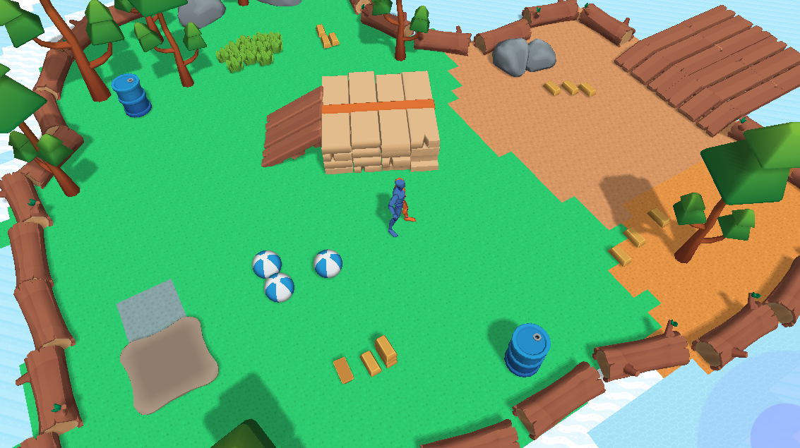

# Defold Third-Person 3D Playground

It is a compact third-person game for the [Defold](https://defold.com/) game engine with:
- a controllable character
- a camera that follows the character
- 3D models with animations
- 3D physics setup
- tilemap-based ground visuals
- collectible items
- a delivery zone for the items
- an on-screen virtual joystick
- gamepad support
- sound effects
- and a custom rendering pipeline with shadow mapping.

The project is meant to be read, changed, and reused.

## License and Credits

This project is released under the MIT License. See [`LICENSE`](LICENSE).

Created by the Defold Foundation.

Assets credits:

- Character model and animations by [Mesh2Motion](https://mesh2motion.org/)
- 3D Models by [KayKit](https://kaylousberg.itch.io/)
- Textures by [Kenney](https://www.kenney.nl)
- Sounds by [Samuel T.W. Neville](https://www.stwnsounds.com)

## Play it online

Playable HTML5 build: https://defold.com/sample-third-person-playground/



## Controls

Move the character with:

- Keyboard - arrow keys or <kbd>W</kbd>,<kbd>S</kbd>,<kbd>A</kbd>,<kbd>D</kbd> keys
- Gamepad - left stick or D-pad
- Mouse / Touch - via the on-screen virtual joystick

### Pickups
`
The character can pick up `gold bars` by walking into them. Carry the bars to the target area and they will be deposited automatically while the player remains inside the trigger zone. 

There is no separate interact button. Pickup and deposit are intentionally automatic. This is a very simple and commonly used mechanics in games.

## Controls Modes

The player controller supports two modes for controls through one boolean script property in
[`game/player_controller.script`](game/player_controller.script):

```lua
go.property("is_control_screen_fixed", true)
```

Can be toggled in the [`game/player.script`](game/player.script) attached in the [`game/player.collection`](game/player.collection):



The setting is a Defold boolean script property, so it appears as a checkbox on the `player` script component in the editor. You can change the default in code, or tick it on/off per instance in the editor.

### Camera relative mode

Set `is_control_screen_fixed ` to `true` - controls are fixed to the screen/camera edges. This is the default mode. Pressing right moves the character toward the right edge of the screen and rotates the visible character to face that movement direction. Pressing down moves toward the bottom of the screen. This is the control style commonly used by top-down, isometric, and fixed-camera games.

### Character relative mode

Set `is_control_screen_fixed` to `false` - controls are relative to the character's current forward direction. In this mode up/down move the character forward/backward along its current facing direction, while left/right rotate the character. This is the original tank-style third-person steering mode.

## How to explore the project

If you are new to Defold, start by running the sample, then read the content below, and explore the project. No need to understand everything at once. Start with the controls, open the ["game/game.collection"](defold://open?path=/game/game.collection), then ["game/player.collection"](defold://open?path=/game/player.collection) to see what components are used and how it's structured. The source files are small enough to read through, and this README points out the important connections.

If you already know Defold, the project is a useful reference for how a small 3D game can be assembled from basic Defold building blocks: collections, game objects, scripts, collision objects, cameras, models, tilemaps, materials, and a custom render script.

The scene is intentionally small, but it touches many parts of a 3D game development in Defold:

- A player collection consisting of parts responsible for:
  - physics (collisionobject),
  - visuals (model),
  - logic (script),
  - and a fixed camera that follows the character.
- Keyboard, gamepad, and mouse/touch controls are supported in the movement controller.
- Two control styles: camera relative movement for fixed camera games, and character relative, where you move and rotate the character - useful for games with camera rotating with the character.
- 3D collision objects for the player, ground, props, collectible gold bars, and trigger zones.
- Runtime parenting, animation, timers, and physics enable/disable messages for carried items.
- Sounds for footsteps, some collisions, gold bar pickup, throwing, and dropping.
- A world assembled from Defold collections, imported models, and a tilemap surface.
- A custom render script that draws the world, builds a shadow map, and applies shadow-aware materials with 3 tiers of quality.

## Project Layout

| Path | Purpose |
| --- | --- |
| [`game.project`](game.project) | Project settings: bootstrap collection, custom render, 3D physics, display, input binding. This is a file that Defold loads on start. |
| [`input/game.input_binding`](input/game.input_binding) | Keyboard, gamepad, and mouse/touch input bindings. |
| [`game/game.collection`](game/game.collection) | Main scene. Instantiates the player, world, GUI controller, shadow setup, and shadow tier service. |
| [`game/player.collection`](game/player.collection) | Player hierarchy: controller scripts, dynamic collision object, camera, character model, animation target. |
| [`game/player_controller.script`](game/player_controller.script) | Movement, steering mode selection, animation state switching, footstep playback, and force application. |
| [`game/steering.lua`](game/steering.lua) | Stateless steering helpers shared by keyboard, gamepad, and touch/mouse control code. |
| [`game/player_collisions.script`](game/player_collisions.script) | Gold pickup, delivery behavior, contact sounds, and pickup/delivery feedback sounds. |
| [`game/audio.lua`](game/audio.lua) | Small sound playback helper. |
| [`game/sounds/`](game/sounds) | Defold sound components for the OGG files in `assets/sounds/`. |
| [`game/gold_bar_audio.script`](game/gold_bar_audio.script) | Gold bar drop sound logic triggered by post-throw physics contact. |
| [`game/controller.gui`](game/controller.gui) | On-screen virtual joystick GUI component. |
| [`game/controller.gui_script`](game/controller.gui_script) | GUI script for virtual joystick. |
| [`game/world.collection`](game/world.collection) | Level layout: ground, props, gold bars, target trigger, release marker. |
| [`game/surface/`](game/surface) | Tilemap and tilesource used for the ground surface. |
| [`assets/sounds/`](assets/sounds) | OGG sound effects used by the sample. |
| [`assets/models/`](assets/models) | Imported GLTF/GLB models, model components, textures, and environment game objects. |
| [`render/`](render) | Custom render file, render script, display profiles, texture profiles. |
| [`game/shadows.script`](game/shadows.script) | Light projection and light transform setup for shadow mapping. |
| [`shadow_mapping/`](shadow_mapping) | Shadow materials, shaders, render-target shadow pass, and material quality tier switching. |

### Bootstrap collection

The bootstrap `game/game.collection` is where the whole game is contained: it instances the player collection, instances the world collection, adds the GUI controller, adds `game/shadows.script` to configure the light, and adds `shadow_mapping/tier_service.script` to choose a shadow quality tier automatically after startup.



Read more details in the [Basic Building Blocks manual](https://defold.com/manuals/building-blocks/).

### Input Bindings

Input starts in [`input/game.input_binding`](input/game.input_binding). Multiple physical inputs
can map to the same action. For example, arrow keys, WASD, and the gamepad D-pad all map to the
same digital movement actions. The gamepad left stick uses separate analog actions so the
controller can preserve stick strength. Supported gamepads are mapped using the built-in `default.gamepads`.



The input binding file uses action names. Arrow keys, WASD, and the gamepad D-pad all dispatch `forward`, `back`, `left`, and`right`. The left stick has separate actions because analog sticks report a signed strength
through `action.value`, and the controller needs that strength for gradual movement.

Read more details in the [Inputs manual](https://defold.com/manuals/input/).

### Input handling

Keyboard, gamepad left stick, gamepad D-pad, and the on-screen joystick all feed the same 2D control vector before this orientation setting is applied.

The input sources share the same sign convention: positive X means right, negative X means left, positive Y means up/forward, and negative Y means down/back. This keeps keyboard, gamepad, and mouse/touch joystick behavior consistent in both control modes.

[`game/player_controller.script`](game/player_controller.script) acquires input focus in `init()` and stores per-instance state on `self`, as Defold scripts should. It keeps digital button state, analog stick state, the current movement amount, and the current facing direction.

[`game/steering.lua`](game/steering.lua) converts digital buttons and analog axes into a single 2D control vector. The player controller then interprets that vector according to the `is_control_screen_fixed` boolean property:

- `true`: normalize the control vector, rotate it by the player collection's base yaw, and use it directly as world movement on the XZ plane. The visible character faces the resulting movement direction. This is the default screen/camera-fixed mode.
- `false`: use the Y axis as forward/back movement and the X axis as rotation input. This makes controls relative to the character's current forward direction.

Keyboard, gamepad, and touch/mouse joystick input all go through this same path. The GUI joystick posts `axis_x` and `axis_y` values to the player, so it uses the same orientation setting as keyboard and gamepad input instead of having its own steering behavior.

### Gamepad Notes

Gamepad bindings are in [`input/game.input_binding`](input/game.input_binding). The sample binds:

- `GAMEPAD_LSTICK_LEFT`, `GAMEPAD_LSTICK_RIGHT`, `GAMEPAD_LSTICK_UP`, `GAMEPAD_LSTICK_DOWN` to analog movement actions.
- `GAMEPAD_LPAD_LEFT`, `GAMEPAD_LPAD_RIGHT`, `GAMEPAD_LPAD_UP`, `GAMEPAD_LPAD_DOWN` to the same digital actions used by keyboard input.

Defold maps physical controllers through its gamepads settings. Common controllers and standard HTML5 gamepads are covered by the built-in mappings. If a controller is unidentified on a target platform, Defold can still report connection/raw input, but normal mapped actions may not fire until a gamepad mapping is added.

See the [gamepads manual](https://defold.com/manuals/input-gamepads/) for details.

### Touch Joystick

The on-screen joystick is a GUI scene in [`game/controller.gui`](game/controller.gui). Its script tracks pointer input on the joystick area, clamps the handle to the joystick radius, normalizes the direction, and posts a `MOVE` message to the player:

```lua
msg.post("game:/player/character", hash("MOVE"), { axis_x = self.direction.x * strength, axis_y = self.direction.y * strength })
```

The player controller receives that message and merges the joystick axes with keyboard and gamepad axes before applying the selected `is_control_screen_fixed` steering mode. Releasing the joystick sends zero axes, which clears touch movement while leaving keyboard and gamepad state independent.

See Defold's [GUI manual](https://defold.com/manuals/gui/), [GUI scripts manual](https://defold.com/manuals/gui-script/), and [message passing manual](https://defold.com/manuals/message-passing/) for the concepts behind this separation.

## Movement logic

The actual movement is physics-driven. In `fixed_update()`, the controller applies force to the player collision object:

```lua
self.force.x = self.direction.x * self.movement * ACCELERATION * 1000
self.force.z = -self.direction.y * self.movement * ACCELERATION * 1000
msg.post("#collisionobject", "apply_force", { force = self.force, position = go.get_position() })
```

The visible character is not the physics root - there is a separation of physics from the visuals. The script rotates the child `/player/character_rotation` object so the model faces the current movement direction while the camera remains fixed relative to the player root.

There are a few important details here:

- Movement happens in `fixed_update()` and the project uses a fixed physics timestep.
- The player collision object has `locked_rotation: true`, so physics contacts do not tip the character over.
- Animation is selected from the physics velocity, not directly from input. This means the character can keep animating naturally while sliding or slowing down.
- Footstep sounds are tied to the active animation state (details in the Sound section below).
- `base_rotation` comes from the collection instance rotation. The movement code uses it to map 2D input into the world orientation of the player collection.
- The model itself has extra rotation in the collection to account for imported model axes. The script rotates `character_rotation`, not the raw model component, so the import correction remains separate from gameplay rotation.

For more details on the pieces used here, see the Defold manuals for [collision objects](https://defold.com/manuals/physics-objects/), [physics](https://defold.com/manuals/physics/), [models](https://defold.com/manuals/model/), and [model animation](https://defold.com/manuals/model-animation/).

## Picking Up and Depositing Gold

The pickup mechanic lives in [`game/player_collisions.script`](game/player_collisions.script). It listens for 3D physics messages from the player's collision object:

- `contact_point_response` with collision group `gold`
- `trigger_response` with collision group `gold_target`

When the player collides with a gold bar, the script checks whether that bar is already carried. If not, it:

1. Gets the character's left hand bone game object with `model.get_go()`.
2. Parents the gold bar to that hand bone.
3. Disables the gold bar collision object so carried bars no longer collide with the world.
4. Animates the bar into a small stack in the character's hand.
5. Stores the bar ids in `self.bars`.

When the player enters the target trigger and carries at least one bar, a repeating timer removes one carried bar every 0.3 seconds. Each removed bar is unparented, animated to `/world/gold_release_position`, and then its collision object is re-enabled.

Read more about [collision messages](https://defold.com/manuals/physics-messages/), [collision groups](https://defold.com/manuals/physics-groups/), [property animation](https://defold.com/manuals/property-animation/), and
[timer callbacks](https://defold.com/ref/timer/).

Two details are worth noticing when you read the code:

- The script stores both the gold game object id and its collision object URL. The visual object is a parent of the hand, while the collision object is disabled and later re-enabled.
- The script uses `go.set_parent(..., true)`. The `true` keeps the object's world transform when changing parent, which avoids visible snapping before the follow-up animation moves the bar into its carried stack position.

## Sound

Sound components live in a single game object [`game/audio.go`](game/audio.go):


The gameplay scripts use those helpers directly:

- Footsteps are controlled by [`game/player_controller.script`](game/player_controller.script). They are tied to the active animation state, not to raw input. `Walk_Loop` uses a slower cadence, `Jog_Fwd_Loop` uses a faster cadence, and idle stops any current footstep sound. The script stops the previous footstep before playing the next one, so running does not stack overlapping footstep voices.
- Ball and barrel contact sounds are played from [`game/player_collisions.script`](game/player_collisions.script) when the player receives a strong enough collision impulse from objects in the `ball` collision group. Barrels are distinguished by their object id. Static environment collisions do not play sounds on collisions.
- Gold pickup plays a pickup sound and a positive feedback sound when a bar is attached to the hand.
- Depositing gold plays a throw sound and a positive feedback sound as each carried bar leaves the hand.
- [`game/gold_bar_audio.script`](game/gold_bar_audio.script) handles the drop sound on each gold bar. The player script arms this sound after throwing the bar, and the bar plays the drop sound, when it contacts the ground, another gold bar, or static geometry.

## World and Physics Setup

The project uses Defold's 3D physics mode with these settings in the `game.project`:
| Setting | Value |
|---|---|
| type | 3D |
| gravity_y | -2500.0 |
| use_fixed_timestep | 1 |

The player is a dynamic collision object with locked rotation. Gold bars are dynamic collision objects. The ground uses a static box collision. The deposit zone is a trigger collision object in the `gold_target` group.

The visual level is assembled in [`game/world.collection`](game/world.collection) from imported forest model game objects, the tilemap ground, the gold bar instances, and a few empty marker objects. Empty game objects such as `gold_release_position` are useful in Defold because they give scripts editable positions without needing special data files.

The project uses Defold collision groups and masks. For example, the player collision object listens for `gold` and `gold_target`, gold bars collide with the player, ground, props, and other gold bars, and the target area is a trigger that only needs to detect the player. When you add your own objects, check both the group and the masks. Simply put, in Defold physics, the group answers "what I am" and the masks - "what I react to".

### Tilemap Ground

The ground image is a regular Defold tilemap:

- [`game/surface/surface.tilemap`](game/surface/surface.tilemap)
- [`game/surface/surface_tiles.tilesource`](game/surface/surface_tiles.tilesource)
- [`assets/tilemap/surface_tilesheet.png`](assets/tilemap/surface_tilesheet.png)

In [`game/world.collection`](game/world.collection), the tilemap component is rotated so it lies on the XZ plane and reads visually as a 3D ground surface. The physics ground is a separate static collision object.

Read more in [Tilemap manual](https://defold.com/manuals/tilemap/), [Tile source manual](https://defold.com/manuals/tilesource/), and check out the [Tilemap collision example](https://defold.com/examples/tilemap/collisions/) and [RPG map sample](https://defold.com/tutorials/rpgmap/).

## Rendering

The project uses a custom render pipeline configured in [`render/custom.render`](render/custom.render) and implemented in [`render/custom.render_script`](render/custom.render_script). The render script is based on Defold's normal render-script approach, but adds a shadow-map pass and a small material quality system.

### Render Script Basics

The render script creates predicates, and each predicate matches material tags. For example, a material tagged `model` is drawn when the render script calls `render.draw(predicates.model)`.

This sample creates these main render predicates in `render/custom.render_script`:

- `model` for regular 3D models.
- `tile` for tilemaps and other tile-tagged content.
- `particle` for particle effects.
- `gui` and `debug_text` for screen-space UI/debug output.

The shadow module creates additional predicates:

- `shadow_surface` for the large transparent receiver plane over the ground.
- `shadow_model` for static non-skinned models.
- `shadow_model_skinned` for the animated character.

The active camera comes from the camera component in `game/player.collection`. The render script checks enabled camera components with `camera.get_cameras()`, then uses the last enabled camera's view and projection. The render script uses Defold camera components when available, but still keeps fallback projection code for stretch, fixed, and fixed-fit projections.

GUI rendering uses a separate screen-space projection, so e.g. the virtual joystick is not affected by the 3D camera and is always on-screen.

### Frame Update Order

The frame update order in `render/custom.render_script` is:

1. Reset color/depth render state with `shadow_mapping.prerender()`.
2. Clear color, depth, and stencil buffers.
3. Select the active camera component and set the viewport.
4. Draw regular `model` content with depth testing and face culling.
5. Draw `tile` and `particle` content.
6. Call `shadow_mapping.render_shadow(self)` to render a light-space depth texture.
7. Call `shadow_mapping.render_shadow_model(...)` to redraw shadow-aware surfaces and models using the shadow texture and light constants.
8. Draw debug 3D lines/text.
9. Reset the world camera and draw GUI/debug text in screen space.

That means the shadow-aware materials are drawn as a second shadow pass after the base world pass. This is easy to follow in a sample project, and it keeps the shadow code localized inside the `shadow_mapping` module and the shadow-specific materials.

### Shadows

Shadow mapping is based on a simple two-step technique:

1. Render the scene from the directional light's point of view into a depth texture.
2. Render the scene from the camera's point of view and compare each fragment against the previously rendered light-space depth texture. If the fragment is farther away than the stored depth, it is in shadow.

In this project, [`shadow_mapping/shadow_mapping.lua`](shadow_mapping/shadow_mapping.lua) owns the shadow render target and the light matrices. It creates a render target named `shadow_buffer` with depth buffer. The shadow system uses render resources declared in `render/custom.render` so the render script can enable shadow materials by name.

The default size of the shadow map is 2048x2048 and this size is one of the most important factors for quality vs performance, so adjust it to your needs in [`shadow_mapping/shadow_mapping.lua`](shadow_mapping/shadow_mapping.lua) here:

```lua
local BUFFER_WIDTH = 2048
local BUFFER_HEIGHT = 2048
```

[`game/shadows.script`](game/shadows.script) configures the light:

- An orthographic projection defines the light's coverage area.
- A position and rotation define the direction from which the shadow map is rendered.
- `shadow_mapping.calculate_light_transform()` converts that into a view matrix.

During the shadow pass, `shadow_mapping.render_shadow()` switches the render target to `shadow_buffer`, uses the light projection and light view, enables a tier-specific `shadow` material, and draws `shadow_surface`, `shadow_model`, and `shadow_model_skinned`.

During the visible shadow pass, `shadow_mapping.render_shadow_model()` builds:

- `mtx_light` - a bias-projection-view matrix that transforms world positions into shadow texture
  coordinates.
- `light` - a vector consumed by the diffuse shaders for directional lighting.

Those values are written into a render constant buffer and passed when drawing the shadow-aware predicates. The vertex shaders, such as [`shadow_mapping/materials/standard_instanced.vp`](shadow_mapping/materials/standard_instanced.vp), calculate `var_texcoord0_shadow = mtx_light * world_position`. The fragment shaders, such as [`shadow_mapping/materials/high/diffuse.fp`](shadow_mapping/materials/high/diffuse.fp), divide by `w`, sample `tex_depth`, and darken the shaded color when the depth comparison says the fragment is occluded from the light.

The ground itself is a bit of a nuance. The visible ground is a tilemap, but the receiver for model shadows is the child object `surface_shadow` in [`game/world.collection`](game/world.collection). It is a large quad using `diffuse_transparent.material` and the `shadow_surface` tag. This model is not casting any shadows, only receives them.

The animated character uses a skinned material and a skinned vertex shader, while props use non-skinned model materials.

### Quality Tiers

The visible 3D objects use materials under [`shadow_mapping/materials/`](shadow_mapping/materials). There are low, mid, and high variants:

| Tier | Screenshot | Description |
|---|---|---|
| `Low` |  | use simple diffuse lighting only and skip shadow sampling. |
| `Mid` |  | sample the shadow map with a cheaper single-sample calculation. |
| `High` |  | use a small 3x3 percentage-closer filtering pattern for softer shadows. |

[`shadow_mapping/tier_service.script`](shadow_mapping/tier_service.script) samples frame time shortly after startup. If the average frame time is too high, it lowers the tier. The active tier is stored in [`shadow_mapping/tiers.lua`](shadow_mapping/tiers.lua). Individual model objects register through [`shadow_mapping/model_tiers.script`](shadow_mapping/model_tiers.script), and when the tier changes the script swaps the component's `material` property to the matching low, mid, or high material.

The low tier intentionally ignores shadows through `tiers.is_shadows_ignored()`. This keeps low-end devices from spending time rendering and sampling the shadow map.

This is a practical pattern, commonly used in games - keep the gameplay objects the same, but swap materials based on the hardware or runtime performance.

For a deeper understanding, read Defold's
[render manual](https://defold.com/manuals/render/),
[material manual](https://defold.com/manuals/material/),
[shader manual](https://defold.com/manuals/shader/),
[camera manual](https://defold.com/manuals/camera/), and
[profiling manual](https://defold.com/manuals/profiling/).

## Notes for Extending

- To add a new collectible, create or duplicate a model game object with a collision object in a dedicated collision group, then extend `player_collisions.script` or split the pickup logic into a reusable module.
- To change the camera, edit the camera child in `game/player.collection`. The current camera follows the player because it is parented under the player hierarchy, while visual character rotation happens on a separate child.
- To change shadow quality behavior, check `shadow_mapping/tier_service.script` and `shadow_mapping/tiers.lua`.

Check out more Defold examples, and tutorials:

- [Defold examples](https://defold.com/examples/)
- [Defold tutorials](https://defold.com/tutorials/)
